# Specialization Stage 3
Repository to store tech challenge of devops specialization stage 3



# Project Overview

This project implements a complete Cloud Native and DevSecOps platform on AWS using:

- Terraform (Infrastructure as Code)
- AWS EKS (Kubernetes)
- ArgoCD (GitOps)
- GitHub Actions (CI/CD)
- Docker + Amazon ECR
- Security Scanning (Trivy + Gosec)
- PostgreSQL, Redis, DynamoDB, and SQS

The architecture follows a **two-layer approach**:

## 1. Infrastructure Layer

Managed with Terraform.

Responsible for provisioning:

- VPC and networking
- EKS cluster
- Databases
- Redis cache
- SQS queues
- ECR repositories
- IAM roles and policies

## 2. GitOps Layer

Managed with ArgoCD.

Responsible for:

- Kubernetes deployments
- Helm charts
- Continuous delivery
- Automated synchronization from Git repositories

---

# Architecture Flow

```text
Developer Push
       ↓
GitHub Actions CI Pipeline
       ↓
Build + Test + Security Scan
       ↓
Docker Image → Amazon ECR
       ↓
Update GitOps Repository
       ↓
ArgoCD Detects Changes
       ↓
Automatic Sync to EKS
```

---

# Repository Structure

```text
specialization-stage3/
│
├── infra/
│   ├── modules/
│   │   ├── networking/
│   │   ├── eks/
│   │   ├── databases/
│   │   ├── messaging/
│   │   └── ecr/
│   │
│   ├── main.tf
│   ├── variables.tf
│   └── outputs.tf
│
├── gitops/
│   ├── argocd/
│   │   ├── install.sh
│   │   └── values.yaml
│   │
│   ├── apps/
│   │   ├── auth/
│   │   ├── flag/
│   │   ├── targeting/
│   │   ├── evaluation/
│   │   └── analytics/
│   │
│   └── helm/
│
└── .github/
    └── workflows/
```

---

# ArgoCD on AWS EKS

## Recommended Approach

The project uses a two-phase deployment strategy:

| Layer | Tool | Responsibility |
|---|---|---|
| Infrastructure | Terraform | AWS resources provisioning |
| GitOps | ArgoCD | Kubernetes application deployment |

This separation improves:

- maintainability
- scalability
- operational clarity
- GitOps best practices

---

# ArgoCD Installation

## Option 1 — Helm Script (Recommended)

Already included in the repository:

```bash
cd gitops/argocd
./install.sh
```

This installs ArgoCD using Helm.

---

## Option 2 — Terraform Helm Provider (Optional)

Terraform can also install ArgoCD:

```hcl
resource "helm_release" "argocd" {
  name       = "argocd"
  repository = "https://argoproj.github.io/argo-helm"
  chart      = "argo-cd"
  namespace  = "argocd"

  values = [
    file("${path.module}/../gitops/argocd/values.yaml")
  ]
}
```

### Why this is NOT recommended

Although possible, managing ArgoCD through Terraform is usually avoided because:

- Terraform should manage infrastructure
- ArgoCD should manage Kubernetes workloads
- Separating concerns aligns better with GitOps principles

---

# Deployment Flow

## Step 1 — Provision Infrastructure

```bash
cd infra
terraform init
terraform apply
```

---

## Step 2 — Configure kubectl

```bash
aws eks update-kubeconfig \
  --name fiap-stage3-eks \
  --region us-east-1
```

---

## Step 3 — Install ArgoCD

```bash
cd gitops/argocd
./install.sh
```

---

## Step 4 — Deploy Applications

```bash
kubectl apply -f gitops/apps/
```

---

## Step 5 — Access ArgoCD UI

```bash
kubectl port-forward \
  -n argocd \
  svc/argocd-server \
  8080:443
```

Access:

```text
https://localhost:8080
```

---

# Project Phases

# Phase 0 — Environment Preparation

Estimated duration: **1–2 days**

### Personal AWS Account

- Create an IAM user
- Grant administrative permissions for Terraform

---

## Create GitHub Repositories

### Main Repository

Contains:

- microservices
- Terraform infrastructure
- CI/CD pipelines

Example:

```text
togglemaster
```

### GitOps Repository

Contains only Kubernetes manifests and Helm definitions.

Example:

```text
togglemaster-gitops
```

---

## Install Local Tools

Required tools:

- Terraform
- AWS CLI
- kubectl
- Helm
- Docker

---

# Phase 1 — Terraform / Infrastructure as Code

Estimated duration: **1–1.5 weeks**

---

## Step 1 — Remote Backend

Create an S3 bucket manually (one-time operation).

Used for Terraform state storage.

Example backend:

```hcl
terraform {
  backend "s3" {
    bucket         = "my-terraform-state"
    key            = "stage3/terraform.tfstate"
    region         = "us-east-1"
    use_lockfile   = true
  }
}
```

---

## Step 2 — Terraform Modules

```text
infra/
└── modules/
    ├── networking/
    │   ├── VPC
    │   ├── Public/Private Subnets
    │   ├── Internet Gateway
    │   └── Route Tables
    │
    ├── eks/
    │   ├── EKS Cluster
    │   └── Node Groups
    │
    ├── databases/
    │   ├── PostgreSQL RDS
    │   ├── ElastiCache Redis
    │   └── DynamoDB
    │
    ├── messaging/
    │   └── SQS
    │
    └── ecr/
        └── ECR repositories
```

---

## Step 3 — Incremental Development

Develop module by module.

Validate after each change:

```bash
terraform plan
```

---

## Step 4 — Final Apply

```bash
terraform apply
```

Validate resources in the AWS Console.

---

# Phase 2 — CI Pipeline / DevSecOps

Estimated duration: **1–1.5 weeks**

Each microservice should contain a dedicated GitHub Actions workflow.

Example:

```text
.github/workflows/ci-auth.yaml
```

---

## Job 1 — Build & Test

```yaml
- uses: actions/setup-go@v5

- run: go build ./...

- run: go test ./...
```

---

## Job 2 — Lint

```yaml
- uses: golangci/golangci-lint-action@v6
```

---

## Job 3 — Security Scans (SAST + SCA)

### Trivy — Dependency Vulnerability Scan

```yaml
- uses: aquasecurity/trivy-action@master
  with:
    scan-type: fs
    exit-code: 1
    severity: CRITICAL
```

### Gosec — Static Analysis

```yaml
- run: go install github.com/securego/gosec/v2/cmd/gosec@latest

- run: gosec ./...
```

---

## Job 4 — Docker Build, Scan and Push

```yaml
- name: Build image
  run: docker build -t $IMAGE_TAG .

- name: Trivy container scan
  uses: aquasecurity/trivy-action@master
  with:
    image-ref: $IMAGE_TAG
    exit-code: 1
    severity: CRITICAL

- name: Login ECR
  uses: aws-actions/amazon-ecr-login@v2

- name: Push image
  run: docker push $ECR_REGISTRY/$SERVICE:${{ github.sha }}
```

---

# Phase 3 — GitOps with ArgoCD

Estimated duration: **1 week**
---

## Step 1 — GitOps Repository Structure

```text
apps/
├── auth/
├── flag/
├── targeting/
├── evaluation/
└── analytics/
```

Each application should contain:

- Deployment
- Service
- ConfigMap
- Ingress
- Helm values

---

## Step 2 — Install ArgoCD

```bash
helm repo add argo https://argoproj.github.io/argo-helm

helm install argocd \
  argo/argo-cd \
  -n argocd \
  --create-namespace
```

---

## Step 3 — Automatic Image Tag Updates

CI updates the GitOps repository automatically:

```yaml
- name: Update image tag in GitOps repo
  run: |
    git clone https://x-token:${{ secrets.GITOPS_TOKEN }}@github.com/your-user/togglemaster-gitops

    cd togglemaster-gitops

    sed -i "s|image: .*auth.*|image: $ECR/$SERVICE:${{ github.sha }}|" apps/auth/deployment.yaml

    git commit -am "ci: update auth to ${{ github.sha }}"

    git push
```

---

## Step 4 — Configure ArgoCD Applications

Each application should use:

```yaml
syncPolicy:
  automated: {}
```

This enables:

- automatic synchronization
- self-healing
- drift correction

---

# Phase 4 — Final Deliverables

Estimated duration: **2–3 days**

---

# Demonstration Video

Maximum duration: **20 minutes**

The video should demonstrate:

- `terraform plan`
- `terraform apply`
- AWS resources created
- Security pipeline failure with vulnerable dependency
- Security fix and successful pipeline
- CI updating GitOps repository
- ArgoCD detecting changes automatically
- Automatic deployment of all microservices

---


# Phase 0 — Preparation (1–2 days)

## 1. Define AWS Environment

* If using AWS Academy: note the LabRole ARN (it will be used in Terraform for EKS)
* If using a personal AWS account: create an IAM user with admin permissions for Terraform

## 2. Create GitHub Repositories

* `togglemaster` (monorepo containing the 5 microservices + Terraform code)
* `togglemaster-gitops` (separate repository only for Kubernetes manifests/Helm)

## 3. Install Local Tools

* terraform
* aws cli
* kubectl
* helm
* docker

---

# Phase 1 — Terraform / IaC (1–1.5 weeks)

## Step 1 — Remote Backend

* Manually create an S3 bucket (only this time) to store the `tfstate`
* Configure the `"s3"` backend in `main.tf` with `use_lockfile = true`

## Step 2 — Module Structure

```text
infra/
  modules/
    networking/   → VPC, public/private subnets, IGW, route tables
    eks/          → EKS cluster + node groups (LabRole for Academy)
    databases/    → 3x PostgreSQL RDS, ElastiCache Redis, DynamoDB
    messaging/    → SQS
    ecr/          → 5 ECR repositories
  main.tf
  variables.tf
  outputs.tf
```

## Step 3 — Implement Each Module

* Implement module by module
* Run `terraform plan` after each step for validation

## Step 4 — Final Apply

* Run `terraform apply`
* Validate all resources in the AWS Console

---

# Phase 2 — CI Pipeline / DevSecOps (1–1.5 weeks)

For each microservice, create:

```text
.github/workflows/ci-<service>.yaml
```

with the following jobs in sequence:

## Job 1 — Build & Test

```yaml
- uses: actions/setup-go@v5
- run: go build ./...
- run: go test ./...
```

## Job 2 — Linter

```yaml
- uses: golangci/golangci-lint-action@v6
```

## Job 3 — SAST + SCA

```yaml
# SCA with Trivy (filesystem mode)
- uses: aquasecurity/trivy-action@master
  with:
    scan-type: fs
    exit-code: 1          # fail if CRITICAL vulnerabilities exist
    severity: CRITICAL

# SAST with gosec
- run: go install github.com/securego/gosec/v2/cmd/gosec@latest
- run: gosec ./...
```

## Job 4 — Docker Build, Scan, and Push to ECR

```yaml
- name: Build image
  run: docker build -t $IMAGE_TAG .

- name: Trivy container scan
  uses: aquasecurity/trivy-action@master
  with:
    image-ref: $IMAGE_TAG
    exit-code: 1
    severity: CRITICAL

- name: Login to ECR
  uses: aws-actions/amazon-ecr-login@v2

- name: Push to ECR
  run: docker push $ECR_REGISTRY/$SERVICE:${{ github.sha }}
```

---

# Phase 3 — GitOps + ArgoCD (1 week)

## Step 1 — GitOps Repository

Structure inside `togglemaster-gitops/`:

```text
apps/
  auth/deployment.yaml
  flag/deployment.yaml
  targeting/deployment.yaml
  evaluation/deployment.yaml
  analytics/deployment.yaml
```

## Step 2 — Install ArgoCD on EKS

```bash
helm repo add argo https://argoproj.github.io/argo-helm

helm install argocd argo/argo-cd \
  -n argocd \
  --create-namespace
```

## Step 3 — Auto-update Image Tag in CI

Add the following step at the end of the CI workflow to update the GitOps repository deployment manifest:

```yaml
- name: Update image tag in GitOps repo
  run: |
    git clone https://x-token:${{ secrets.GITOPS_TOKEN }}@github.com/your-user/togglemaster-gitops

    cd togglemaster-gitops

    sed -i "s|image: .*auth.*|image: $ECR/$SERVICE:${{ github.sha }}|" apps/auth/deployment.yaml

    git commit -am "ci: update auth to ${{ github.sha }}"

    git push
```

## Step 4 — Configure ArgoCD Applications

* Create one ArgoCD Application for each folder in the GitOps repository
* Configure:

```yaml
syncPolicy:
  automated: {}
```
---

# Phase 4 — Deliverables (2–3 days)

## Demonstration Video (≤20 min)
Show:

* `terraform plan` + `terraform apply`

  * or the AWS Console with created resources
* Intentionally introduce a vulnerable dependency

  * show the pipeline failing in Trivy
* Fix the vulnerability

  * show the pipeline succeeding
* Show the CI pipeline pushing the new image tag to the GitOps repository
* Show ArgoCD detecting the change and automatically syncing the 5 microservices

---

# PDF Report


### Team Members

Names of all participants.

---

### Repository Links

- Main repository
- GitOps repository
- Demonstration video

---

## Technical Decisions

Explain:

- architecture choices
- Terraform modularization
- GitOps strategy
- security tools
- CI/CD approach

---

## Cost Estimation

Include screenshots from:

- AWS Pricing Calculator
- Estimated monthly infrastructure cost

---

# Key Concepts

| Tool | Responsibility |
|---|---|
| Terraform | Infrastructure provisioning |
| EKS | Kubernetes platform |
| ArgoCD | GitOps deployment |
| GitHub Actions | CI/CD automation |
| Trivy | Vulnerability scanning |
| Gosec | Static code analysis |
| ECR | Container registry |

| Terraform = Infrastructure | 
|---|
|ArgoCD = Application Deployment (runs on the infrastructure) |

They work together but shouldn't be mixed. Terraform provisions EKS, then ArgoCD deploys to EKS.


---

# Final Notes

This project demonstrates a complete modern DevOps platform using:

- Infrastructure as Code
- GitOps
- Kubernetes
- DevSecOps
- CI/CD automation
- Cloud Native architecture
- AWS managed services

The architecture was designed to follow production-grade engineering practices with scalability, automation, observability, and security in mind.